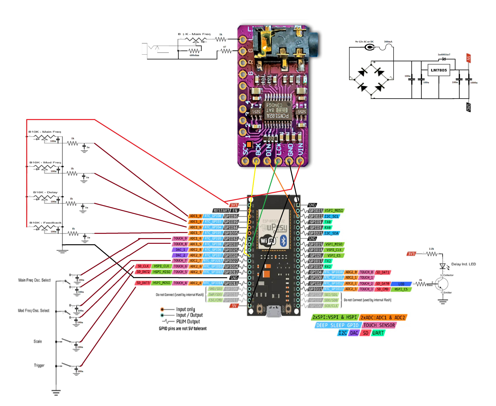
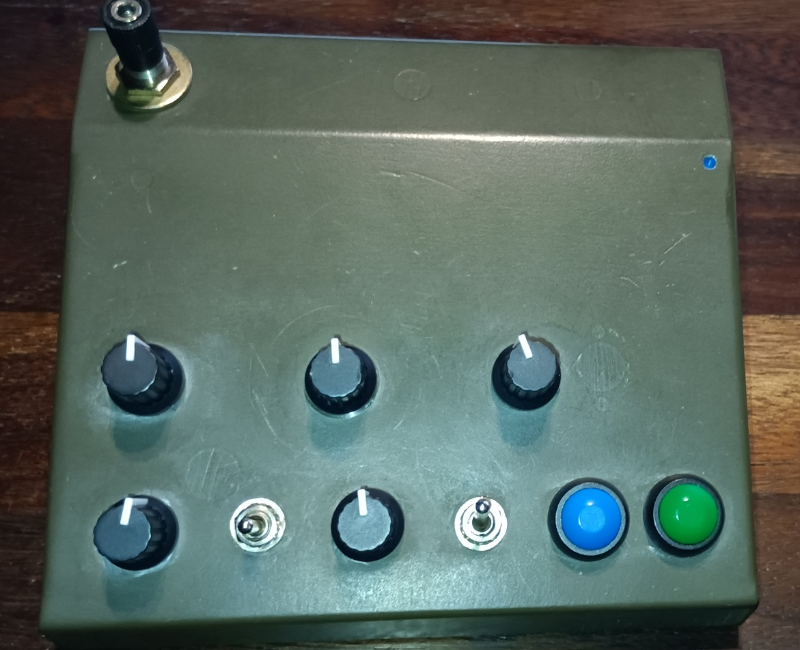
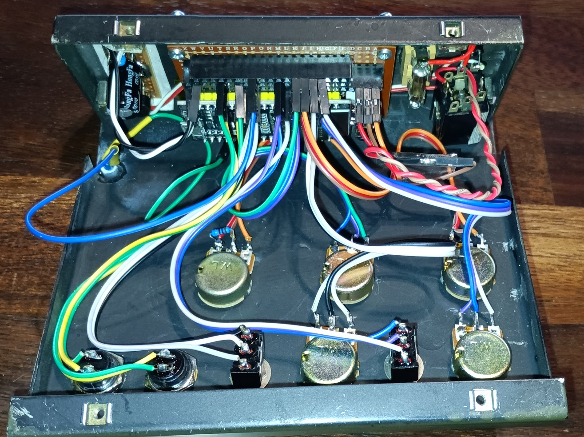

# DubFXsiren
Siren dub for a friend.

# 🔊 Dub Siren on ESP32

A DIY **dub siren** synth built on an **ESP32** with real-time audio synthesis, **I2S DAC output**, and a **modulation delay** effect. Fully tweakable with **potentiometers** and **buttons**, it’s ready to dub up your sound system!

## 🎛️ Features

- Real-time audio synthesis using FreeRTOS tasks
- **Main oscillator** with selectable waveforms: sine, saw, square
- **Modulation oscillator (LFO)** with sine, saw, and square shapes
- **Delay effect** with interpolation and dynamic feedback control
- Built-in **ASR envelope** (Attack–Sustain–Release)
- High-quality **I2S stereo output** (96 kHz / 16-bit)
- Real-time control via 4 potentiometers, 2 buttons and 2 Switchs
- Status LED indicates Delay activity

## ⚙️ Hardware Requirements
| Component                        | Description                                                        |
|----------------------------------|--------------------------------------------------------------------|
| Node-MCU-32S ESP-WROOM-32        | Microcontroller (ESP32, WiFi + Bluetooth)                          |
| PCM5102 (I2S DAC Module)         | Digital-to-Analog Converter (Stereo audio output)                  |
| 4x  B10K Potentiometers           | Controls: Main Freq, Mod Freq, Delay, Feedback                     |
| 2x  Push Buttons                  | Inputs: Scale, Trigger                                             |
| 2x  Switch 3 pos                  | Inputs: Main Freq Sel, Mod Freq Sel                                |
| 1x  LED                           | Delay indicator (blinks or lights up during audio delay)           |
| 1x  2.2kΩ Resistor                | Current limiting resistor for the LED                              |
| 1x  NPN Transistor (e.g., 2N2222) | Drives the LED from ESP32 GPIO                                     |
| 1x  LM7805 Regulator              | 5V linear voltage regulator                                        |
| 1x  Bridge Rectifier              | Converts AC to DC for power input                                  |
| 2x  1000µF Capacitors             | Power supply filtering                                             |
| 12x 100nF Capacitors              | High-frequency bypass capacitors                                   |
| 4x  1uF Capacitors                | LPF input                                                          |
| 1x  10µF Capacitor                | Additional filtering (LM7805 output)                               |
| 6x  1k Resistors                  | LPF input & audio output protect & led                             |
| 5x  47ohm Resistors               | audio output protect                                               |
| 1x  680ohm Resistor               | Volum pot exp rectification                                        |
| 1x  6.5mm Mono Audio Jack         | Audio line-out from PCM5102                                        |

## 🔌 Diagram

## 🔌 Pinout

### I2S Audio (PCM5102):

| Signal | ESP32 Pin |
|--------|-----------|
| BCLK   | GPIO 26   |
| LRCK   | GPIO 25   |
| DATA   | GPIO 22   |

### Potentiometers:

| Function               | ESP32 Pin |
|------------------------|-----------|
| Main Frequency         | GPIO 36   |
| Modulation Frequency   | GPIO 39   |
| Delay Advance          | GPIO 34   |
| Delay Feedback         | GPIO 35   |

### Buttons (active LOW, internal pull-ups):

| Function                   | ESP32 Pin |
|----------------------------|-----------|
| Trigger                    | GPIO 13   |
| Mod Reset / Drop           | GPIO 12   |
| Mod Waveform Selector      | GPIO 14 / 27 |
| Main Waveform Selector     | GPIO 32 / 33 |

### LED:

| Function    | ESP32 Pin |
|-------------|-----------|
| Delay LED   | GPIO 2    |

## 🎚️ Controls

| Control        | Description                                       |
|----------------|---------------------------------------------------|
| Pot 1          | Main oscillator frequency (25–3519 Hz, exponential) |
| Pot 2          | Modulation frequency (1–60 Hz)                    |
| Pot 3          | Delay advance (time)                              |
| Pot 4          | Delay feedback (with saturation control)          |
| Button 1       | Trigger sound                                     |
| Button 2       | Mod reset / Drop                                  |
| Switch 1       | Mod waveform: sine / saw / square                 |
| Switch 2       | Main waveform: sine / saw / square                |

## 🔈 Audio Specs

- **Sample rate**: 96 kHz
- **Bit depth**: 16-bit
- **Output**: Stereo (duplicated mono signal)
- **Delay effect**: Interpolated, with feedback saturation detection

## 🧠 Technical Highlights

- **Direct digital synthesis (DDS)** via 32-bit phase accumulators
- **1024-point sine lookup table** with cubic interpolation
- Signal math done in **Q16 fixed-point** (16.16 format)
- Uses **FreeRTOS**: audio task on Core 0, UI task on Core 1
- Optimized for **real-time performance** and glitch-free audio

## 📂 Project Structure

- `computeSample()`: core audio synthesis
- `TaskAudio()`: handles I2S buffer streaming
- `TaskInterface()`: reads buttons/pots and maps values
- `sine_table[]`: precomputed full-wave sine LUT
- `DELAYBUFFER[]`: circular buffer for delay effect

## 📂 Project Images

Strongly inspired by :
  https://github.com/ChrisBall/Dub-Siren-Files
  https://todbot.com/blog/2023/05/16/cheap-stereo-line-out-i2s-dac-for-circuitpython-arduino-synths/
  https://github.com/pschatzmann/ESP32-A2DP/wiki/External-DAC
  https://macsbug.wordpress.com/wp-content/uploads/2021/02/pcm5102a_dac_schematic.pdf
